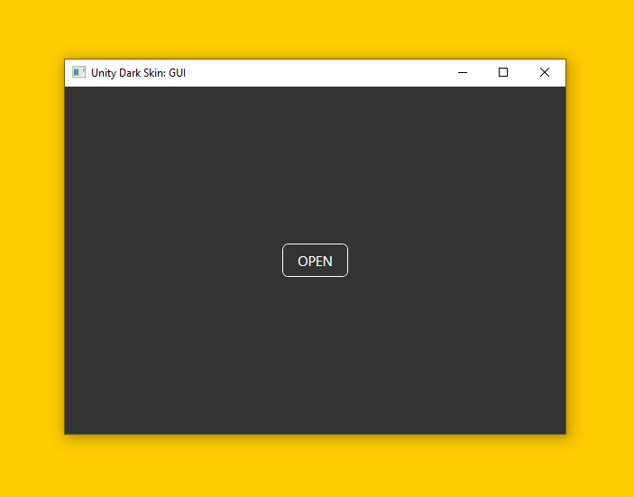
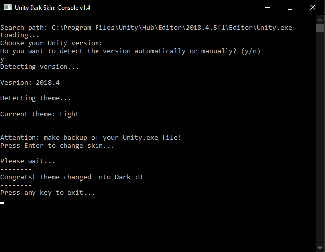
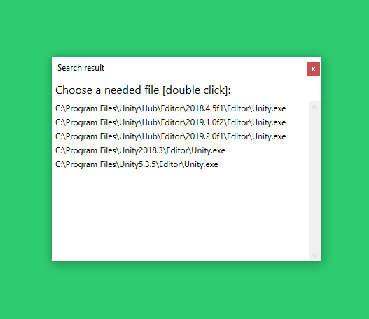
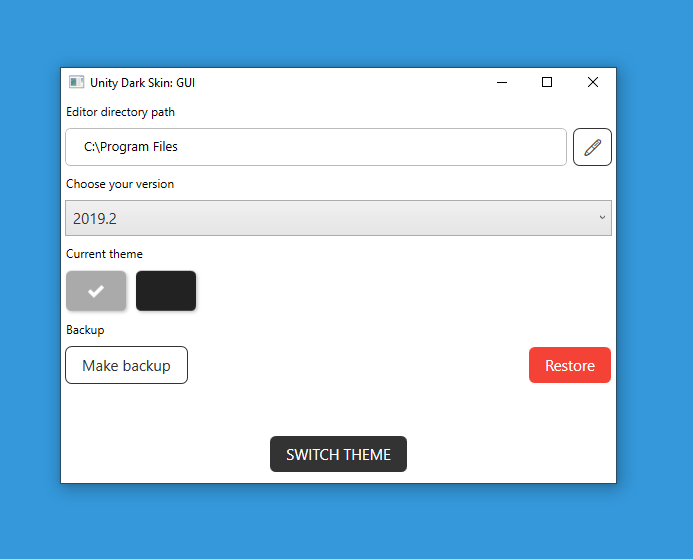
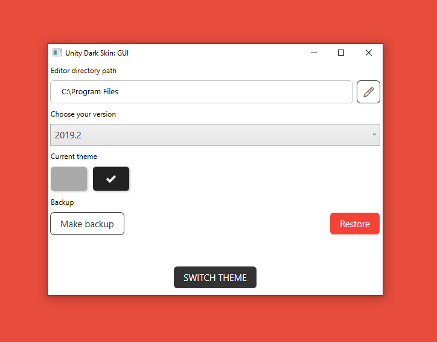

# UnityDarkSkin

## About

This tool makes Dark Theme in Unity Editor and turns it back to white, if you wish. It's being useful for Unity Personal, where Dark Theme is disabled by default. **It is not a crack! It's simply changing a couple of bits in Editor.exe**

## Usage

1. Compile it with Visual Studio and copy UnityDarkSkin.exe to folder where Unity.exe is located
2. Run UnityDarkSkin.exe as **administrator**

## Supported versions

| Version | Support | Version tested |
| :--- | :---: | :--- |
| 5.3    | ✅ | 5.3.5f1    |
| 5.4    | ✅ | 5.4        |
| 2017.2 | ✅ | 2017.2     |
| 2018.2 | ✅ | 2018.2     |
| 2018.3 | ✅ | 2018.3.0f2 |
| 2018.4 | ✅ | 2018.4.5f1 |
| 2019.1 | ✅ | 2019.1.0f2 |
| 2019.2 | ✅ | 2019.2.0f1 |
| 2019.3 | ⚠️ | -          |
| 2019.4 | ❌ | -          |

✅ - Supported | ⚠️ - Will be supported soon | ❌ - Not supported

## How it works

| Before | After |
| :---: | :---: |
|  |  |

## Showcase

| UnityDarkSkin.App | UnityDarkSkin |
| :---: | :---: |
|  |  |
|  |  |
|  |  |
|  |  |

## Code base

| Project >     | UnityDarkSkin | UnityDarkSkin.App | UnityDarkSkin.Lib |
| --- | --- | --- | --- |
| Description    | Legacy Console edition  | WPF app | DLL with patching tool|
| .NET Framework | v 4.5.2       | v 4.5.2  | v 4.5.2  |
